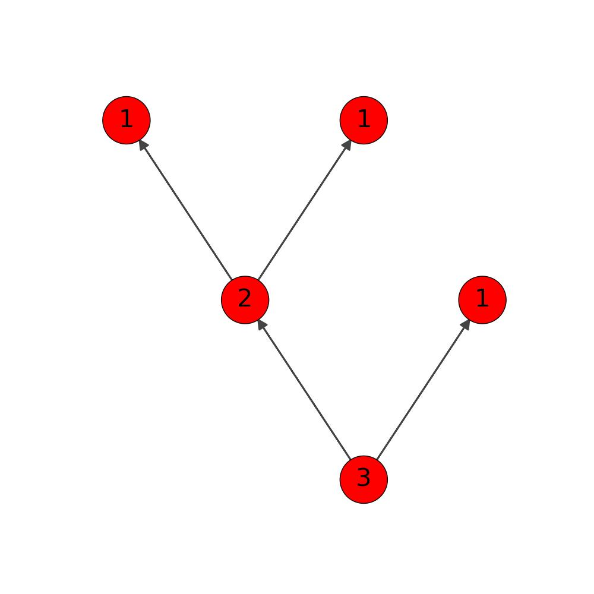
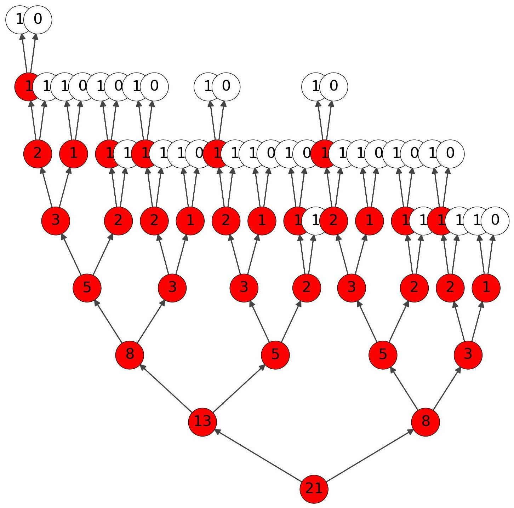
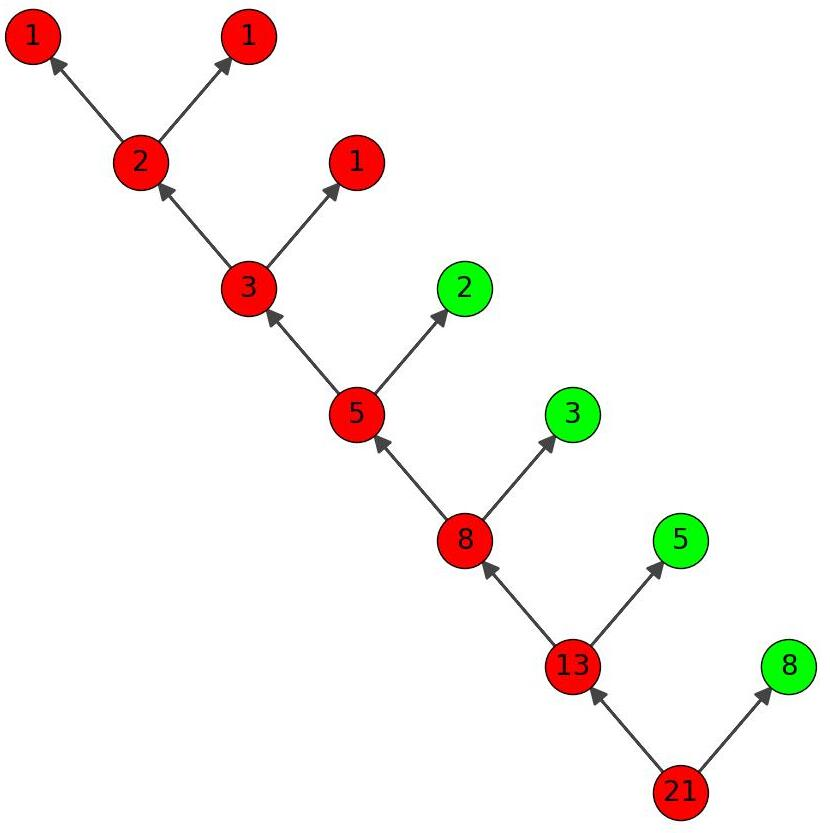

<style>
    h1 { font-size: 60px; margin: .67em 0 }
    section {font-size: 50px}
    header, footer {
        font-size: 20px
    }
</style>
<!--_paginate: false-->
<!--_class: invert -->

# <!--fit--> АиСД лекция 5

# Рекурсия 
---
## :smirk_cat: Что такое рекурсия?

---
## :cat: Что такое рекурсия?

Рекурсия - это возможность функции вызывать саму себя.
Рекурсия включает в себя
- Базовый случай
- Переход
---
## :smiley_cat: Ряд Фибоначчи

0, 1, 1, 2, 3, 5, 8, 13, 21, 34 ...
Рекурсивное представление
$$fib_n = fib_{n-1} + fib_{n-2}$$
$$ fib_0 = 0 $$
$$ fib_1 = 1 $$
---
## :heart_eyes_cat: Что такое базовый случай ?

``` py
def fib(n: int) -> int:
    if n <= 1:                   # Базовый случай
        return 1
    return fib(n-1) + fib(n-2)   # Переход
```

---
## :crying_cat_face: Что такое зацикливание ?
Когда рекурсия начинает бесконечно вызывать саму себя
``` py
def fib(n: int) -> int:
    return fib(n-1) + fib(n-2) + fib(n)
```
---
## :crying_cat_face: Что такое зацикливание ?
Или когда вы плохо учли базовый случай
``` py
def fib(n: int) -> int:
    if n == 0 or n == 1:
        return 1
    return fib(n-1) + fib(n-2)
fib(-1)
```

---
## :bear: Рассмотрим код
``` py
def fib(n: int) -> int:
    if n <= 0:
        return 0
    if n == 1:
        return 1
    return fib(n-1) + fib(n-2)
```
---
:tiger: Какие рекурсивные вызовы будут при вызове?
``` py
fib(4)  # Сколько всего будет вызовов fib?
```
$$
fib(4) \rightarrow fib(3) + fib(2)
$$
$$
fib(3) \rightarrow fib(2) + fib(1) 
$$
$$
fib(2) \rightarrow   fib(1) + fib(0)
$$
---

<style>
img[alt~="center"] {
  display: block;
  margin: 0 auto;
}
</style>


---

## :brain: Давайте подумаем

Сколько вызовов fib, будет если передать аргументом число 8?

Какое 8-е число Фибоначчи?

---



- 67 вызовов функции fib
- восьмое число Фибоначчи это 21


---

## :koala: Меморизация

``` python
def fib(n: int) -> int:
    global memory
    if n in memory:
        return memory[n]
    if n <= 0:
        return 0
    elif n == 1:
        return 1
    memory[n] = fib(n - 1) + fib(n-2)
    return memory[n]


```

---



- fib_with_memory
- 13 вызовов функции fib

---
## :fish: Стек вызовов функций
<style scoped>
    li {
        font-size: 43px;
        list-style-type: "🔥";
    }
</style>

Ошибка stack overflow - переполнение стека вызовов.
- Есть рекурсивный цикл
- Слишком много вызовов, нужна меморазиция
- Выделенный стек маленький, необходимо его расширить

---
<style scoped>
    p {
        font-size: 30px;
    }
</style>
Стек вызовов функций (call stack) - это механизм хранения информации о вызванных функциях во время выполнения программы. Каждый раз, когда функция вызывается, информация о её выполнении добавляется в верхнюю часть стека. При завершении выполнения функции, она удаляется из стека.

Стек вызовов функций позволяет программе отслеживать порядок вызовов функций и правильно возвращаться к вызывающей функции после завершения выполнения текущей. Он также помогает избежать переполнения стека (stack overflow) путем ограничения максимальной глубины стека вызовов.

---

# <!--fit--> Thank you for atention
### @pr0bk4 - Степан
### @googlewaitme - Булат
### https://vk.com/suai_it

